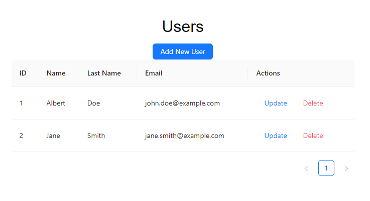
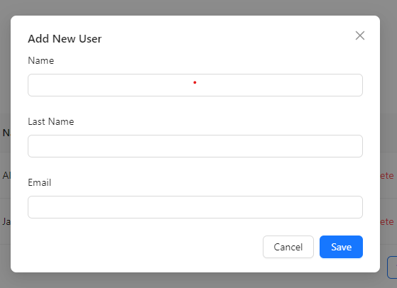
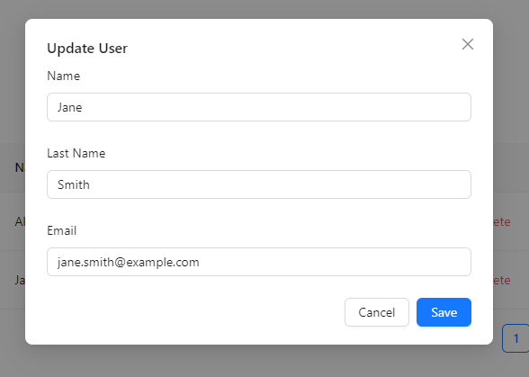

# User Management Application

## Overview

This project is a user management application with a backend built using Express.js, Prisma, and MySQL, and a frontend developed with React.js and TypeScript. The application supports creating, updating, and deleting users with a rich UI provided by the Ant Design library.

## Backend

### Technologies Used

- **Express.js**: For building the server and API endpoints.
- **Prisma**: For handling database operations and queries.
- **MySQL**: The database used to store user data.
- **Nodemon**: For real-time updates during development.

### Getting Started

1. Navigate to the backend folder:

   ```bash
   cd backend
   npm start
   ```

   to run the backend
   We use XAMPP in this project to create a local development environment that includes a web server (Apache) and a database server (MySQL)

###

2. Navigate to the frontend folder:

```bash
npm run dev
```

To run the frontend

### Here are some UI






